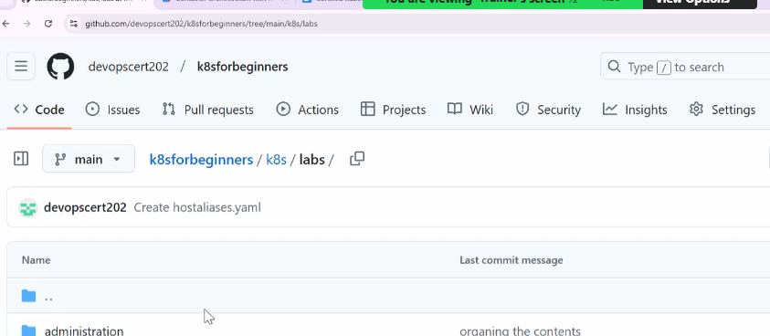

# Kubernetes
This repo contains the learnings of Kubernetes

https://docs.google.com/document/d/1i9BYnkVwFlgC1UQHaZjk5PCW_YSkpbahWCr6Xu_yplo/edit?tab=t.0#heading=h.12i6jv8chozy

Kubernestes is container orchestration service

LXC is a linux container

Container helps to package the software to ship the 

Official Kubernetes Documentation can be used for clearning Certified kubernetest Administrator.
https://kubernetes.io/docs/reference/kubectl/quick-reference/

Calico is the container networking 

https://docs.google.com/document/d/1JpMotBqasF7RSjVEeJPclThvLKz3kidEOHb2iMvT4g8/edit?tab=t.0
https://docs.google.com/document/d/1g0Aar1s526i2gWIQw7Kp0cKvUCiWlYaFtRFSL5c02LY/edit?tab=t.0#heading=h.10o65ijo6gny
https://docs.google.com/document/d/1i9BYnkVwFlgC1UQHaZjk5PCW_YSkpbahWCr6Xu_yplo/edit?tab=t.0#heading=h.12i6jv8chozy
https://docs.google.com/document/d/1JpMotBqasF7RSjVEeJPclThvLKz3kidEOHb2iMvT4g8/edit?tab=t.0
https://docs.google.com/document/d/1g0Aar1s526i2gWIQw7Kp0cKvUCiWlYaFtRFSL5c02LY/edit?tab=t.0#heading=h.10o65ijo6gny
https://docs.google.com/document/d/1g0Aar1s526i2gWIQw7Kp0cKvUCiWlYaFtRFSL5c02LY/edit?tab=t.0#heading=h.kvuhtnasgio5
https://kubernetes.io/docs/reference/kubectl/quick-reference/

Different contianer software that are available
LXC is the linux container
Docker
ContainerD (CRI ctl is the command line control) - ContainerD is the open source software for containers or an alternate to Docker.

What is HTTPD used for?
HTTPd is a software program, that usually runs in the background, as a process. It plays the role of server in a client-server model using HTTP and/or HTTPS network protocols. HTTPd waits for the incoming client requests and for each request it answers by replying with requested information.

Container Orchestration 

Container orchestration is the process of automating the management of containerized applications and services. It includes:
provisioning, deploying, scaling, securing, networking, ensuring availability, and monitoring container lifecycles.

Kubernetes originally developed by Google and later outsourced it CNCF company and it motives the Kubernetes developer community.
CNCF manages the life cycle of various kubernetes version.

CNCF also conducts CKA exam.

CKA is for 395$

Google Kubernetes Engine
AWS 
Azure

Hyperscaler based offerings
Google AKS
or Standalone product-based offerings from Redhat such as Openshift

A cluster is a collection of one or more servers or nodes

Control plane is responsbile for Cluster Management
Data plane

There can be more than one master node

Kube API server is the heart of the Kubernetes cluster. It is going to host many APIs

etcd :

pod: is a team of people responsible to accomplish a task
The miminal unit of work that Kubernetest is responsbile for unit of work

In Windows it is called as TASK

Container orchestration is the process of automating the management of containerized applications and services. It includes:
provisioning, deploying, scaling, securing, networking, ensuring availability, and monitoring container lifecycles. 

Container orchestration can be used in any computing environment that supports containers, including:
- Traditional on-premises servers 
- Public, private, hybrid, and multicloud computing environments 

Container orchestration tools can help simplify container infrastructure management. They can be used to manage containerized applications throughout the entire software lifecycle, from development and deployment to testing and monitoring. 

Some container orchestration platforms include: 

- Kubernetes: A common container orchestration platform in the cloud-native world 
- Apache Mesos: A container orchestration platform 
- Docker-compose: A container orchestration platform 
- Azure Kubernetes Service (AKS): A container orchestration solution available on Microsoft Azure 
- Amazon Elastic Container Service (ECS): A Kubernetes-as-a-Service provider 
- Google Kubernetes Engine (GKE): A Kubernetes-as-a-Service provider 
- RedHat OpenShift Container Platform: A Kubernetes-as-a-Service provider

Kubernetes is a greek word is captain of the ship.

K8S is K(ubernete)s

HELM Chart which is the package manager to manage applications.

Defacto standard after docker is containerD

2 method of deploying objects

- imperative (give an instruction to get a job done)
- declarative (definining the requirements )

ARGO CD (https://argo-cd.readthedocs.io/en/stable/) like Jenkins works with K8S

Github Link

**Windows Sub System for Linux**
You can run windows as well as ubuntu terminal

https://docs.google.com/document/d/1ikdoPeElFCGsAmNH2hIZ9iSTQKczxODruiddqzY8Thk/edit?tab=t.0#heading=h.jf5hkrvzh0jg

https://docs.google.com/document/d/1tRae7JQ1HJ_uo3WqleZmfYgdn-N9bDXIcH00xshxzkY/edit?tab=t.0#heading=h.cplz6gsv01tr

https://docs.google.com/document/d/1mmmNOQwWBP0_QMHvDR4vmZt8Nl80hP-vtvjNajGPLKY/edit?tab=t.0#heading=h.kjndtfqvjipi

https://docs.google.com/document/d/1UY6rwiUdfEHGIBJoEZAxAaqO1ghUw3XUuedqPZXAlIc/edit?tab=t.0

https://github.com/devopscert202/k8sforbeginners.git

https://docs.google.com/document/d/1KkkFxEs2RuNo35mNZ0L7c4CDJbye7zzLvmjFH756GX0/edit?tab=t.0

https://training.linuxfoundation.org/certification/certified-kubernetes-administrator-cka/

https://jsonformatter.org/yaml-validator

https://github.com/devopscert202/k8sforbeginners.git

https://github.com/devopscert202/k8sforbeginners/blob/98d2181070fd0c36b037ba90836a009889c08ec4/k8s/docs/networking/networking-basics.md

CIS(Center for internet Security) Container OS Hardening Techniques and baselining

https://docs.google.com/spreadsheets/d/1RPpyDOLFmcgxMCpABDzrsBYWpPYCIBuvAoUQLwOGoQw/edit?gid=907731238#gid=907731238

aws eks update-kubeconfig  --region us-east-1 --name eksdemo
In AWS master node is not managed by us

